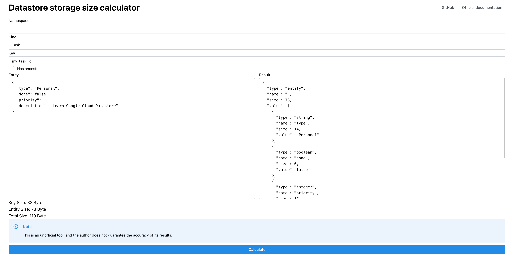

# Datastore storage size calculator

A storage size calculation tool for Google Cloud Datastore.

> [!NOTE]
> This is an unofficial tool, and the author does not guarantee the accuracy of its results.

## Status

| Type                | Supported |
|---------------------|-----------|
| Array               | ✅         |
| Blob                | ❌         |
| Boolean             | ✅         |
| Double              | ✅         |
| Embedded entity     | ✅         |
| Geographical point  | ✅         |
| Integer             | ✅         |
| Key                 | ❌         |
| Null                | ✅         |
| String              | ✅         |
| Timestamp           | ✅         |
